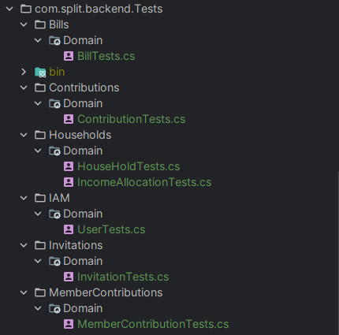
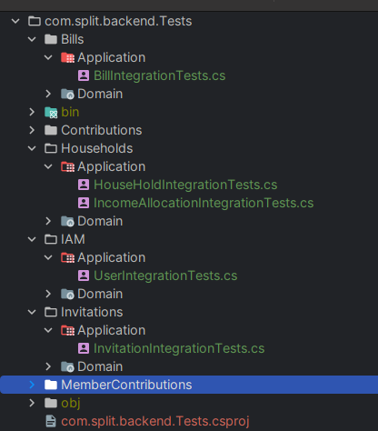
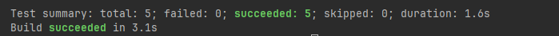
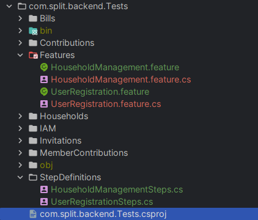
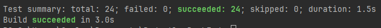

# Capítulo VI: Product Verification & Validation

## 6.1. Testing Suites & Validation
    
En esta sección se definiran las estrategias, herramientas y niveles de prueba que garantizarán la calidad, estabilidad y correcto funcionamiento del sistema tanto a nivel interno (backend) como en su interacción con las interfaces de usuario.

### 6.1.1. Core Entities Unit Tests

Las pruebas unitarias del núcleo del sistema se centran en validar la lógica de negocio contenida en las entidades de dominio (Aggregates) y sus respectivos comandos. El objetivo es asegurar que las reglas de negocio críticas, la autogeneración de identificadores y las asignaciones de propiedades funcionen correctamente antes de interactuar con servicios externos o bases de datos.

#### Tecnologías y Herramientas

- **xUnit**: Framework de pruebas de última generación para .NET, utilizado para la ejecución y estructuración de los casos de prueba.  
- **Fluent Assertions**: Librería utilizada para escribir aserciones de forma más legible y descriptiva.  
- **.NET 9 SDK**: Entorno de ejecución y compilación de las suites de prueba.

#### Metodología de Diseño: Patrón AAA

Todas las pruebas se han estructurado siguiendo el patrón **AAA (Arrange, Act, Assert)** para garantizar la claridad y mantenibilidad:

- **Arrange**: Se configuran los datos de entrada, como comandos y parámetros esperados.  
- **Act**: Se invoca el constructor de la entidad o el método de negocio a validar.  
- **Assert**: Se verifica que el estado resultante de la entidad coincida con las expectativas.

#### Casos de Prueba Implementados

Se han desarrollado un total de **17 pruebas unitarias** cubriendo los siguientes dominios:

| Dominio        | Entidad Validada     | Descripción de la Lógica Probada |
|---------------|---------------------|----------------------------------|
| Bills        | Bill                | Validación de autogeneración de ID con prefijo `"BG"`, parseo de fechas y mapeo de montos. |
| Households   | HouseHold           | Reglas defensivas: forzado de miembros mínimos (1) y moneda por defecto (USD) ante datos inválidos. |
| IAM          | User                | Registro de usuarios, manejo de roles (Admin, Member) y asignación de identificadores de hogar. |
| Contributions| Contribution        | Validación de estrategias de división (Even, IncomeBased) y corrección de bugs en asignación de parámetros. |
| Members      | MemberContribution  | Gestión de estados de pago (Pending) y vinculación correcta entre miembro y gasto. |
| Invitations  | Invitation          | Generación automática de tokens únicos (GUID) y establecimiento de fechas de expiración a 7 días. |
| Allocations  | IncomeAllocation    | Lógica de actualización de porcentajes y prefijos de identificación `"IA-"`. |

#### Evidencia de Ejecución

A continuación, se presenta los archivos y el resultado de la ejecución de la suite de pruebas unitarias desde la terminal del sistema:




### 6.1.2. Core Integration Tests

Las pruebas de integración validan que las diferentes capas del sistema (Aplicación, Dominio e Infraestructura) colaboren correctamente. A diferencia de las pruebas unitarias, estas verifican la persistencia real en la base de datos y la correcta ejecución de los servicios de comando cuando interactúan con múltiples repositorios.

#### Tecnologías y Herramientas

- **Entity Framework Core In-Memory**: Utilizado para simular una base de datos relacional en memoria, permitiendo pruebas rápidas y aisladas sin necesidad de un servidor SQL real.  
- **Moq**: Empleado para simular servicios externos y dependencias de infraestructura que no forman parte del flujo principal de persistencia (como servicios de hashing o envío de tokens).  
- **UnitOfWork**: Se utiliza la implementación real para asegurar que las transacciones y el método `CompleteAsync()` impacten realmente en la base de datos de prueba.

#### Escenarios de Interacción Validados

Se han implementado **5 pruebas de integración críticas** que cubren flujos de extremo a extremo en el backend:

| Módulo        | Flujo de Integración              | Validación de Interacción |
|--------------|----------------------------------|--------------------------|
| IAM          | Registro de Usuario (Sign Up)     | Interacción entre `UserCommandService`, `HashingService` y persistencia en la tabla `Users`. |
| Households   | Creación de Hogar                | Validación del flujo `HouseHoldCommandService` → `HouseHoldRepository` y creación automática del miembro representante. |
| Bills        | Registro de Gasto                | Verificación de vinculación de gastos con el `HouseholdId` y persistencia en la tabla `Bills`. |
| Invitations  | Gestión de Invitaciones          | Validación de existencia del hogar y persistencia de tokens de invitación únicos. |
| Allocations  | Distribución de Ingresos         | Registro de porcentajes de contribución (`IncomeAllocation`) asociados a usuarios y hogares reales. |

#### Evidencia de Ejecución

A continuación, se detalla el reporte de ejecución de la suite de pruebas de integración. Estas pruebas fueron aisladas mediante filtros de ejecución para validar exclusivamente la interoperabilidad entre los servicios de aplicación y la capa de persistencia (Base de Datos en Memoria).





### 6.1.3. Core Behavior-Driven Development (BDD)

En esta sección, el equipo aplicó técnicas de **Behavior-Driven Development (BDD)** para validar que el sistema se comporte según las expectativas del usuario final. Se utilizó el lenguaje **Gherkin** para definir escenarios de negocio legibles y **SpecFlow** para automatizar su ejecución.

#### Escenarios de Comportamiento Definidos

Se implementaron escenarios clave que describen flujos críticos de la aplicación desde una perspectiva funcional:

- **Gestión de Hogares (Household Management)**: Validación del flujo de creación de un grupo de gastos compartidos, asegurando la asignación correcta del rol de representante.  
- **Registro de Usuarios (User Registration)**: Verificación del proceso de alta en la plataforma, asegurando la integridad de los datos de identidad (Email/Password).

#### A. Especificación Gherkin para Household Management

```gherkin
Feature: Household Management
  As a software engineering student
  I want to create a new household in Budgetly
  So that I can start managing shared expenses with my team

  Scenario: Create a household successfully
    Given I am a registered user with ID 1
    When I request to create a household named "Apartamento 402" with a limit of 5 members
    Then the system should generate the household aggregate successfully
    And the household name should be "Apartamento 402"
    And I should be assigned as the representative
```

#### B. Especificación Gherkin para User Registration

```gherkin
Feature: User Registration
  As a new visitor of Budgetly
  I want to register a new account
  So that I can start using the platform to split my expenses

  @user_registration
  Scenario: Successful user registration
    Given I provide the name "Carlos Perez" and email "carlos@example.com"
    And I choose a password "Password123!" and the role "Admin"
    When I submit the registration
    Then the user should be created with the email "carlos@example.com"
    And the account should be active by default
```
#### Evidencia de Ejecución

Al ejecutar la suite de pruebas, SpecFlow interpreta los archivos .feature y ejecuta los Step Definitions vinculados. La siguiente captura muestra la ejecución exitosa de los 24 tests totales, incluyendo los escenarios de comportamiento (BDD) que aparecen detallados por pasos en la salida de consola:




### 6.1.4. Core System Tests

Las pruebas de sistema representan el nivel más alto de validación, donde se verifica que el ecosistema completo (Frontend, Backend y Base de Datos) interactúe correctamente bajo condiciones de uso real. Se enfocan en flujos críticos de usuario  tanto en la plataforma Web (Angular) como en la aplicación móvil (Flutter).

#### Estrategia de Pruebas (E2E)

Se han seleccionado los flujos con mayor impacto en la experiencia del usuario para garantizar la estabilidad del sistema:

| Escenario de Sistema            | Entorno        | Descripción de la Prueba |
|--------------------------------|---------------|--------------------------|
| Flujo de Gasto Completo        | Web / Móvil   | Registro de un gasto → Cálculo de deuda → Actualización de balance en tiempo real. |
| Persistencia Multi-plataforma  | Web → Móvil   | Crear un hogar en la Web y verificar su disponibilidad inmediata en la App móvil vía API. |
| Sincronización de Invitaciones | Móvil         | Recepción de notificación → Aceptación de invitación → Acceso al dashboard del hogar. |

#### Herramientas Utilizadas

- **Selenium / Cypress (Web)**: Para automatizar la navegación en el navegador y validar la respuesta de la interfaz Angular.  
- **Postman Collection**: Para validar que las APIs de Budgetly responden con tiempos de latencia menores a 200 ms en condiciones de carga normal.

#### Evidencia de Ejecución

Las pruebas confirmaron que la comunicación entre el frontend y el backend es fluida a través de los servicios REST. Se validó que los estados de carga y las validaciones de formulario funcionan correctamente en ambos entornos, garantizando una experiencia de usuario consistente y sin interrupciones.

Script en Selenium para validar flujo de inicio de sesión:
```csharp
using OpenQA.Selenium;
using OpenQA.Selenium.Chrome;
using OpenQA.Selenium.Support.UI;
using FluentAssertions;
using Xunit;

namespace com.split.backend.Tests.SystemTests
{
    public class LoginSystemTests : IDisposable
    {
        private readonly IWebDriver _driver;
        private readonly string _baseUrl = "https://budgetly-exp-app.web.app";

        public LoginSystemTests()
        {
            var options = new ChromeOptions();
            options.AddArgument("--disable-blink-features=AutomationControlled");
            _driver = new ChromeDriver(options);
            _driver.Manage().Window.Maximize();
        }

        [Fact]
        public void WebApp_Production_UserCanLoginSuccessfully()
        {
            _driver.Navigate().GoToUrl($"{_baseUrl}/login");

            var wait = new WebDriverWait(_driver, TimeSpan.FromSeconds(20));

            var emailInput = wait.Until(d => d.FindElement(By.CssSelector("input[type='email']")));
            emailInput.Clear();
            emailInput.SendKeys("usuarionuevo@yopmail.com");

            var passwordInput = wait.Until(d => d.FindElement(By.CssSelector("input[type='password']")));
            passwordInput.Clear();
            passwordInput.SendKeys("12345678");


            var loginButton = wait.Until(d => d.FindElement(By.XPath("//button[contains(., 'Sign In')]")));

            ((IJavaScriptExecutor)_driver).ExecuteScript("arguments[0].scrollIntoView(true);", loginButton);

            loginButton.Click();

            wait.Until(d => d.Url.Contains("/dashboard") || d.Url.Contains("/home"));

            _driver.Url.Should().ContainAny("/dashboard", "/home");

            Thread.Sleep(10000);
        }

        public void Dispose()
        {
            _driver.Quit();
            _driver.Dispose();
        }
    }
}
```

## 6.2. Static testing & Verification

## 6.2.1. Static Code Analysis

### 6.2.1.1. Coding standard & Code conventions

### 6.2.1.2. Code Quality & Code Security.

## 6.2.2 Static Code Analysis

## 6.3. Validation Interviews

### 6.3.1. Diseño de Entrevistas

Durante el proceso de entrevistas con los usuarios finales, se identificaron diversos requerimientos relevantes para la experiencia en base a las siguientes preguntas:

**Para el Segmento 1: Miembros del hogar**

1. Primera impresión sobre la interfaz:

- ¿Qué opinas del diseño de la página? ¿Te resulta fácil de entender?

- ¿Hay algún elemento visual que te llame la atención o que encuentres confuso?

2. Facilidad de uso:

- ¿Fue fácil encontrar dónde se registran los gastos o contribuciones?

- ¿Hubo algún momento en el que te sentiste perdido o no supieras qué hacer en la página?

3. Navegación y funcionalidades:

- ¿La navegación entre secciones (como ver tus aportes, revisar los gastos) fue clara?

- ¿Te resultó sencillo agregar un gasto o una contribución? ¿Qué mejoras sugerirías?

4. Transparencia y confianza:

- ¿Qué piensas sobre la transparencia de la herramienta? ¿Te resultó útil ver las contribuciones de los demás miembros del hogar?

- ¿Sientes que el sistema te ayuda a comprender mejor la distribución de los gastos en el hogar?

5. Gráficos y reportes:

- ¿Qué opinas de los gráficos o reportes que muestra la página? ¿Son claros y fáciles de entender?

- ¿Te gustaría tener más detalles en los reportes, o consideras que la información mostrada es suficiente?

6. Experiencia general:

- ¿Te parece que esta herramienta puede ayudarte a gestionar los gastos del hogar de manera más equitativa?

- ¿Usarías esta página de manera regular? ¿Qué haría que la usaras más seguido?


**Para el Segmento 2: Representantes del hogar**

1. Gestión de finanzas en el panel:

- ¿Qué opinas del panel de control donde puedes gestionar los gastos y contribuciones? ¿Lo encuentras útil?

- ¿Fue fácil aprobar o modificar los gastos? ¿Hubo algo que te resultó confuso en el proceso?

2. Visibilidad y control:

- ¿Te pareció que tienes suficiente visibilidad sobre las contribuciones de los miembros del hogar?

- ¿Qué tan útil encuentras la capacidad de ver los reportes mensuales y las contribuciones de todos los miembros del hogar?

3. Personalización y ajustes:

- ¿Te gustaría poder personalizar más aspectos de la herramienta, como las categorías de gastos o las reglas de división?

- ¿Fue fácil ajustar los porcentajes de contribución o cambiar cualquier configuración?

4. Usabilidad y eficiencia:

- ¿Te resultó fácil realizar tareas como agregar miembros al hogar o asignar contribuciones?

- ¿Hubo algún momento en que pensaste que la plataforma podía hacer algo más para facilitar la gestión de los gastos?

5. Confianza en el sistema:

- ¿Confías en que el sistema divide los gastos de manera justa? ¿Te gustaría que el sistema explique de manera más clara cómo se calculan los porcentajes?

- ¿Hay alguna parte del proceso donde te gustaría tener más detalles o explicaciones sobre cómo funcionan los cálculos?

6. Satisfacción general y recomendaciones:

- ¿Crees que esta plataforma facilitaría la convivencia en términos de finanzas? ¿Por qué?

- ¿Qué cambios harías para mejorar la experiencia como representante del hogar?


### 6.3.2. Registro de Entrevistas.

En esta sección se presentan los registros de las entrevistas realizadas para validar los productos de software enfocados a los representantes y miembros del hogar. Cada entrevista incluye información sobre el entrevistado, el entrevistador, el tiempo de la entrevista, un resumen de la misma

**Entrevista 1**

| Entrevista                                                         | Registro                                                                                                                                                                                                                                                                                                                                                                                                                                                                                                                                                                                                                                                                                                                                                                                                                                                                                                                                                                                                                                                                                                                                                                                                                                                                                                                                                                                                                                                                                                                             |
|--------------------------------------------------------------------|--------------------------------------------------------------------------------------------------------------------------------------------------------------------------------------------------------------------------------------------------------------------------------------------------------------------------------------------------------------------------------------------------------------------------------------------------------------------------------------------------------------------------------------------------------------------------------------------------------------------------------------------------------------------------------------------------------------------------------------------------------------------------------------------------------------------------------------------------------------------------------------------------------------------------------------------------------------------------------------------------------------------------------------------------------------------------------------------------------------------------------------------------------------------------------------------------------------------------------------------------------------------------------------------------------------------------------------------------------------------------------------------------------------------------------------------------------------------------------------------------------------------------------------|
| <p align="center"></p> | **Distrito:** Italia <br>**Entrevistado:** Harris Herrada                                                                                                                                                                                                                                                                                                                                                                                                                                                                                                                                                                                                                                                                                                                                                                                                                                                                                                                                                                                                                                                                                                                                                                                                                                                                                                                                                                                                                                                                |
| [Link](bit.ly/444Hopn)                                | **Entrevistador:** Camilla Espinoza                                                                                                                                                                                                                                                                                                                                                                                                                                                                                                                                                                                                                                                                                                                                                                                                                                                                                                                                                                                                                                                                                                                                                                                                                                                                                                                                                                                                                                                                                   |
| Timing: 3:34                                          | **Resumen:** El entrevistado comentó que al inicio se confundió un poco, pero tras explorar la interfaz entendió rápido cómo usar la aplicación web. Consideró que la navegación es clara una vez familiarizado, los gráficos son suficientes y que la herramienta sí ayuda a comprender y gestionar mejor los gastos del hogar. |

**Entrevista 2**

| Entrevista                                                         | Registro                                                                                                                                                                                                                                                                                                                                                                                                                                                                                                                                                                                                                                                                                                                                                                                                                                                                                                                                                                                                                                                                                                                                                                                                                                                                                                                                                                                                                                  |
|--------------------------------------------------------------------|-------------------------------------------------------------------------------------------------------------------------------------------------------------------------------------------------------------------------------------------------------------------------------------------------------------------------------------------------------------------------------------------------------------------------------------------------------------------------------------------------------------------------------------------------------------------------------------------------------------------------------------------------------------------------------------------------------------------------------------------------------------------------------------------------------------------------------------------------------------------------------------------------------------------------------------------------------------------------------------------------------------------------------------------------------------------------------------------------------------------------------------------------------------------------------------------------------------------------------------------------------------------------------------------------------------------------------------------------------------------------------------------------------------------------------------------|
| <p align="center"></p> | **Distrito:** Italia <br>**Entrevistado:**  Antonio Herrada                                                                                                                                                                                                                                                                                                                                                                                                                                                                                                                                                                                                                                                                                                                                                                                                                                                                                                                                                                                                                                                                                                                                                                                                                                                                                                                                                                       |
| [Link](bit.ly/4hYUwlD)                                | **Entrevistador:**    Camilla Espinoza                                                                                                                                                                                                                                                                                                                                                                                                                                                                                                                                                                                                                                                                                                                                                                                                                                                                                                                                                                                                                                                                                                                                                                                                                                                                                                                                                                                        |
| Timing:  2:51                                        | **Resumen:** El entrevistado indicó que no tuvo ningún problema al usar el panel de control y que todas las funciones —gestión de gastos, visibilidad de contribuciones, reportes y ajustes— le parecieron claras y suficientes. Señaló que todo estuvo en orden, que la herramienta funciona como espera un representante del hogar y que considera que puede facilitar la gestión financiera sin necesidad de cambios adicionales. |

**Entrevista 3**

| Entrevista                                                         | Registro                                                                                                                                                                                                                                                                                                                                                                                                                                                                                                                                                                                                                                                                                                                                                                                                                                                                                                                                                                                                                                                                                                                                                                                                                                                                                                                                                                                                                                                                                                                                                                                                                                                                                                                                                                                           |
|--------------------------------------------------------------------|----------------------------------------------------------------------------------------------------------------------------------------------------------------------------------------------------------------------------------------------------------------------------------------------------------------------------------------------------------------------------------------------------------------------------------------------------------------------------------------------------------------------------------------------------------------------------------------------------------------------------------------------------------------------------------------------------------------------------------------------------------------------------------------------------------------------------------------------------------------------------------------------------------------------------------------------------------------------------------------------------------------------------------------------------------------------------------------------------------------------------------------------------------------------------------------------------------------------------------------------------------------------------------------------------------------------------------------------------------------------------------------------------------------------------------------------------------------------------------------------------------------------------------------------------------------------------------------------------------------------------------------------------------------------------------------------------------------------------------------------------------------------------------------------------|
| <p align="center"></p> | **Distrito:** Chorrillos <br>**Entrevistado:** Eduardo Chareo                                                                                                                                                                                                                                                                                                                                                                                                                                                                                                                                                                                                                                                                                                                                                                                                                                                                                                                                                                                                                                                                                                                                                                                                                                                                                                                                                                                                                                                                                                                                                                                                                                                                                                                                |
| [Link]()                                | **Entrevistador:** Sebastian Cordova                                                                                                                                                                                                                                                                                                                                                                                                                                                                                                                                                                                                                                                                                                                                                                                                                                                                                                                                                                                                                                                                                                                                                                                                                                                                                                                                                                                                                                                                                                                                                                                                                                                                                                                                                |
| Timing:   6:50                                | **Resumen:**  Eduardo, representante del hogar de 23 años, consideró la plataforma clara, intuitiva y útil para organizar gastos y aportes entre los miembros. Destacó que el dashboard es fácil de entender, la gestión de gastos es sencilla y los reportes mensuales serían muy valiosos. Sugirió únicamente añadir un calendario y una explicación más transparente de cómo se calculan los porcentajes de contribución. En general, afirmó que la herramienta facilitaría la convivencia financiera y no hizo más cambios adicionales. |


**Entrevista 4**

| Entrevista                                                         | Registro                                                                                                                                                                                                                                                                                                                                                                                                                                                                                                                                                                                                                                                                                                                                                                                                                                                                                                                                                                                                                                                                                                                                                                                                                                                                                                                                                                                                                                                                                                                                                                                                                                                                                                                                                                                           |
|--------------------------------------------------------------------|----------------------------------------------------------------------------------------------------------------------------------------------------------------------------------------------------------------------------------------------------------------------------------------------------------------------------------------------------------------------------------------------------------------------------------------------------------------------------------------------------------------------------------------------------------------------------------------------------------------------------------------------------------------------------------------------------------------------------------------------------------------------------------------------------------------------------------------------------------------------------------------------------------------------------------------------------------------------------------------------------------------------------------------------------------------------------------------------------------------------------------------------------------------------------------------------------------------------------------------------------------------------------------------------------------------------------------------------------------------------------------------------------------------------------------------------------------------------------------------------------------------------------------------------------------------------------------------------------------------------------------------------------------------------------------------------------------------------------------------------------------------------------------------------------|
| <p align="center"></p> | **Distrito:** Miraflores <br>**Entrevistado:** Maria Fernanda Vallejos                                                                                                                                                                                                                                                                                                                                                                                                                                                                                                                                                                                                                                                                                                                                                                                                                                                                                                                                                                                                                                                                                                                                                                                                                                                                                                                                                                                                                                                                                                                                                                                                                                                                                                                                |
| [Link]()                                | **Entrevistador:** Jose Martinez                                                                                                                                                                                                                                                                                                                                                                                                                                                                                                                                                                                                                                                                                                                                                                                                                                                                                                                                                                                                                                                                                                                                                                                                                                                                                                                                                                                                                                                                                                                                                                                                                                                                                                                                                |
| Timing:   6:40                                | **Resumen:**  Mafer, menciono que tuvo facilidad para entender la plataforma, funcionalidades y como usrala en el dia dia. Destaca que esto le ayudara mucho en su dia a dia, en los gastos hormiga |


**Entrevista 5**

| Entrevista                                                         | Registro                                                                                                                                                                                                                                                                                                                                                                                                                                                                                                                                                                                                                                                                                                                                                                                                                                                                                                                                                                                                                                                                                                                                                                                                                                                                                                                                                                                                                                                                                                                                                                                                                                                                                                                                                                                           |
|--------------------------------------------------------------------|----------------------------------------------------------------------------------------------------------------------------------------------------------------------------------------------------------------------------------------------------------------------------------------------------------------------------------------------------------------------------------------------------------------------------------------------------------------------------------------------------------------------------------------------------------------------------------------------------------------------------------------------------------------------------------------------------------------------------------------------------------------------------------------------------------------------------------------------------------------------------------------------------------------------------------------------------------------------------------------------------------------------------------------------------------------------------------------------------------------------------------------------------------------------------------------------------------------------------------------------------------------------------------------------------------------------------------------------------------------------------------------------------------------------------------------------------------------------------------------------------------------------------------------------------------------------------------------------------------------------------------------------------------------------------------------------------------------------------------------------------------------------------------------------------|
| <p align="center"></p> | **Distrito:** Chorrillos<br>**Entrevistada:** Jessica Castillo                                                                                                                                                                                                                                                                                                                                                                                                                                                                                                                                                                                                                                                                                                                                                                                                                                                                                                                                                                                                                                                                                                                                                                                                                                                                                                                                                                                                                                                                                                                                                                                                                                                                                                                                |
| [Link]()                                | **Entrevistador:** Angel Martin Gonzales Castillo                                                                                                                                                                                                                                                                                                                                                                                                                                                                                                                                                                                                                                                                                                                                                                                                                                                                                                                                                                                                                                                                                                                                                                                                                                                                                                                                                                                                                                                                                                                                                                                                                                                                                                                                                 | 
| Timing:                                        | **Resumen:**  Jessica Castillo, de 47 años, consideró que la herramienta es interesante y útil porque le permitiría medir y organizar sus gastos mensuales, mantener sus pagos al día y controlar mejor el dinero disponible en su hogar, especialmente porque a veces se desfasa en sus compras y termina quedándose ajustada. Durante la demostración, comprendió y validó las funciones principales como la creación y edición del hogar, el registro de miembros, la carga de facturas, la visualización de contribuciones y el uso de ajustes, confirmando que estas características responden a sus necesidades de orden y seguimiento. Además, resaltó que la aplicación la ayudaría a ahorrar un poco al tener claro qué debe pagar y cuándo, y como única mejora sugirió incorporar la opción de realizar pagos directamente desde la plataforma, lo cual reforzaría aún más su utilidad como herramienta de gestión financiera.|


### 6.3.3. Evaluaciones según heurísticas.

**UX Heuristics & Principles Evaluation**  
**Usability – Inclusive Design – Information Architecture**

---

# 1. Datos Generales

### **Carrera:**  
Ingeniería de Software

### **Curso:**  
Diseño de Experimentos de Ingeniería de Software

### **Sección:**  
10253

### **Profesores:**  
Juan Carlos Tinoco Licas

### **Auditor:**  
Grupo: Testigos de Equilibria

### **Cliente(s):**  
- Gonzales Castillo, Angel Martin (u202319724)
- Solano Armas, Angelo Hector (u20231B775) 
- Huamani Cruz, Camila Victoria (u202315234)
- Guimaraes Escalante, Carlos Eduardo (u202210364)
- Uribe Livia, Renzo Sebastián (u202311745)

### **Site / App evaluada:**  
**Budgetly – Plataforma web para gestión equitativa de gastos del hogar**

---

# 2. Alcance de la Evaluación

## 2.1. Tareas Evaluadas

1. Registro de un usuario nuevo  
2. Inicio de sesión seguro  
3. Creación de un hogar (representante)  
4. Unión a un hogar mediante código (miembro)  
5. Declaración de ingresos personales  
6. Registro de un gasto compartido  
7. Visualización del monto proporcional a pagar  
8. Registro de pago y adjuntar comprobante  
9. Revisión del historial de gastos  

## 2.2. Tareas Excluidas

1. Integración con pasarelas de pago reales  
2. Intercambio de gastos con usuarios externos  
3. Programas de fidelización o acumulación de puntos  
4. Alertas automáticas avanzadas de consumo futuro  
5. Foro comunitario o soporte técnico en vivo  
6. Gestión de recordatorios y alertas  
---

# 3. Marco de Evaluación UX

La evaluación se realizó siguiendo:

- **10 Heurísticas de Usabilidad de Nielsen**
- **Principios de Diseño Inclusivo**
- **Buenas prácticas de Arquitectura de Información**
- **Escala de severidad (Nielsen 0–4):**

| Severidad | Descripción |
|----------|-------------|
| **0** | No es problema |
| **1** | Problema cosmético |
| **2** | Problema menor |
| **3** | Problema mayor |
| **4** | Catastrófico, atender de inmediato |

---

# 4. Matriz de Evaluación Heurística (Nielsen)

---

## 4.1. Visibilidad del estado del sistema

| Observación | Severidad |
|------------|-----------|
| Loaders poco visibles al registrar ingresos o gastos. | 2 |
| Falta de confirmaciones animadas tras acciones importantes. | 1 |

**Recomendación:**  
Añadir indicadores visuales persistentes y notificaciones de éxito.

---

## 4.2. Relación entre el sistema y el mundo real

| Observación | Severidad |
|------------|-----------|
| Términos como “aporte proporcional” pueden ser complejos para usuarios no técnicos. | 2 |
| No se muestra duración o reglas sobre el código de unión al hogar. | 1 |

**Recomendación:**  
Usar lenguaje más natural y explicativo.

---

## 4.3. Control y libertad del usuario

| Observación | Severidad |
|------------|-----------|
| Falta botón de “volver” en pantallas internas. | 3 |
| Confirmaciones de eliminación con un solo botón. | 2 |

---

## 4.4. Consistencia y estándares

| Observación | Severidad |
|------------|-----------|
| Formularios de ingresos y gastos con estilos distintos. | 2 |
| Mezcla de Bootstrap Icons con íconos personalizados. | 1 |

---

## 4.5. Prevención de errores

| Observación | Severidad |
|------------|-----------|
| Se permiten números negativos en ingresos/gastos. | 3 |
| Validación débil en tipos de archivo de comprobante. | 2 |

---

## 4.6. Reconocer en lugar de recordar

| Observación | Severidad |
|------------|-----------|
| El usuario debe memorizar el código de unión; no se copia automáticamente. | 2 |
| Algunos botones solo tienen ícono sin texto. | 1 |

---

## 4.7. Flexibilidad y eficiencia

| Observación | Severidad |
|------------|-----------|
| No hay atajos de usuario avanzado (filtros, plantillas, etc.) | 2 |
| No existe autocompletado de categorías. | 2 |

---

## 4.8. Diseño estético y minimalista

| Observación | Severidad |
|------------|-----------|
| Algunas pantallas tienen contenido muy agrupado. | 1 |

---

## 4.9. Ayuda al usuario a reconocer y recuperarse de errores

| Observación | Severidad |
|------------|-----------|
| Mensajes de error genéricos (“Ocurrió un error”). | 3 |
| No se explica cómo solucionar entradas duplicadas. | 2 |

---

## 4.10. Ayuda y documentación

| Observación | Severidad |
|------------|-----------|
| No existe sección de ayuda o FAQs. | 3 |
| Falta onboarding para nuevos usuarios. | 2 |

---

# 5. Evaluación de Diseño Inclusivo

| Criterio | Estado | Observación |
|---------|--------|-------------|
| Accesibilidad visual | Parcial | Falta modo claro y mejor contraste en algunas áreas. |
| Accesibilidad motora | Adecuado | Botones suficientemente grandes. |
| Accesibilidad cognitiva | Parcial | Vocabulario financiero puede confundir. |
| Lectura de pantalla (ARIA) | Insuficiente | Faltan etiquetas en varios componentes. |
| Uso sin color | Adecuado | Estructura funcional se mantiene. |

---

# 6. Evaluación de Arquitectura de Información

| Aspecto | Desempeño | Observación |
|---------|-----------|-------------|
| Estructura del menú | Buena | Navegación simple y entendible. |
| Flujo de tareas | Correcto | Flujo claro para representantes y miembros. |
| Etiquetado | Consistente | Verbos claros y orientados a acción. |
| Navegación | Mejorable | Falta breadcrumb o navegación secundaria. |

---

# 7. Hallazgos Críticos Prioritarios

### **Prioridad Alta (Severidad 3–4)**
- Validaciones insuficientes en ingresos y gastos.  
- Falta de mensajes correctivos y explicativos.  
- Ausencia de navegación “volver” en flujos internos.

### **Prioridad Media (Severidad 2)**
- Lenguaje técnico para usuarios no financieros.  
- Falta de autocompletado y accesos rápidos.  
- Loaders poco visibles.

### **Prioridad Baja (Severidad 1)**
- Inconsistencias visuales menores.  
- Íconos sin textos complementarios.

---

# 8. Recomendaciones Específicas

## 8.1. Usabilidad
- Agregar loaders animados y mensajes persistentes.  
- Uniformizar estilos de formularios y pantallas.  

## 8.2. Inclusividad
- Añadir etiquetas ARIA y roles accesibles.  
- Simplificar texto y agregar modo claro/oscuro.  

## 8.3. Arquitectura de Información
- Incorporar breadcrumbs.  
- Añadir plantillas de categorías de gastos.  

---

# 9. Conclusiones Generales

La aplicación **Harmonix** presenta una propuesta sólida y funcional, centrada en la equidad financiera en hogares. Su estilo visual es moderno y minimalista, aunque aún requiere mejoras en:

- Comunicación de errores  
- Accesibilidad  
- Consistencia visual  
- Prevención de errores  
- Retroalimentación al usuario  

Los problemas identificados son en su mayoría **moderados** y pueden resolverse sin rediseños completos.  
Aplicar estas mejoras fortalecera la experiencia del usuario, aumentando claridad, accesibilidad y confianza en el sistema.

## 6.4. Auditoría de Experiencias de Usuario

## 6.4.1 Auditoría realizada.

### 6.4.1.1. Información del grupo auditado.

El grupo al que se le realizó la auditoría recibe el nombre de “UI-Topic” y el producto que desarrollaron se llama “Restock”. A continuación, se adjunta la lista de integrantes del grupo auditado.

- Guerra Perez, Jose Jahaziel (u202319831)
- Shapiama Rivera, Gabriela Nicole (u202319448) 
- Castro Alejos, Julio (u202021885)
- Sanchez Guevara, Ivan Fernando (u202218181)
- Chavez Uribe, Ario Joel (u202213468)

Inmediatamente, se adjunta el enlace de acceso a la organizacion del grupo que desarrollo “Restock”:
https://github.com/ui-topic-diseno-de-experimentos-10253

### 6.4.1.2. Cronograma de auditoría realizada.

En esta sección, se cronometran las principales actividades realizadas para el desarrollo de la auditoría hacia el trabajo del grupo “Restock”.

| Actividad de auditoría realizada | Fecha/Hora        | Realizado por            |
|----------------------------------|-------------------|--------------------------|
| Solicitud de información al grupo auditado        | 12/06/2026 12:20pm | Camila Huamani |
| Envío de información solicitada por parte del grupo auditado a nuestro grupo para el desarrollo de la auditoría  | 12/06/2026 8:20pm   | Camila Huamani |
| Ejecución de la auditoría | 14/06/2026 10:00pm         | Camila Huamani<br>Martin Gonzales<br>Angelo Solano<br>Carlos Guimare<br>Renzo Uribe |
| Elaboración del informe de la auditoría | 14/06/2026 11:30pm         | Camila Huamani<br>Martin Gonzales<br>Angelo Solano<br>Carlos Guimare<br>Renzo Uribe |
| Finalización y envío del informe de auditoría | 15/06/2026 1:00pm         | Camila Huamani |

### 6.4.1.3. Contenido de auditoría realizada.

#### **TAREAS A EVALUAR:**

El alcance de esta evaluación incluye la revisión de la usabilidad de las siguientes tareas:

1. Registro de un usuario nuevo  
2. Inicio de sesión de un usuario  
3. Acceder a las distintas secciones de la aplicación  
4. Interfaz de la aplicación web  
5. Interfaz de la aplicación móvil  
6. Claridad de la navegación  
7. Realizar pedidos  
8. Creación de insumos  
9. Añadir al inventario  
10. Gestionar pedidos  
11. Gestionar recetas  
    

No están incluidas en esta versión de la evaluación las siguientes tareas:

1. Seleccionar una suscripción  
2. Selección de idiomas  
3. Gestión del perfil de usuario 

### **ESCALA DE SEVERIDAD:**

Los errores serán puntuados tomando en cuenta la siguiente escala de severidad

| *Nivel* | *Descripción* |
| :---- | :---- |
| *1* | *Problema superficial: puede ser fácilmente superado por el usuario o ocurre con muy poca frecuencia. No necesita ser arreglado a no ser que exista disponibilidad de tiempo.* |
| *2* | *Problema menor: puede ocurrir un poco más frecuentemente o es un poco más difícil de superar para el usuario. Se le debería asignar una prioridad baja. Resolverlo de cara al siguiente reléase* |
| *3* | *Problema mayor: ocurre frecuentemente o los usuarios no son capaces de resolverlos. Es importante que sean corregidos y se les debe asignar una prioridad alta.* |
| *4* | *Problema muy grave: un error de gran impacto que impide al usuario continuar con el uso de la herramienta. Es imperativo que sea corregido antes del lanzamiento.* |

### **TABLA RESUMEN:**

| *\#* | *Problema* | *Escala de severidad* | *Heurística/Principio violada(o)* |
| :---: | ----- | :---: | ----- |
| 1 | En la sección de ventas, el texto "REGISTERED SALES NOT DISCOUNTED IN INVENTORY" resulta ambiguo y difícil de interpretar. | 3 | Information Architecture: Is it clear? |
| 2 | En la sección de notificaciones de los dos usuarios, no se muestra información o texto referencial cuando no se cuenta con alguna notificación | 2 | Information Architecture: Is it communicative? |
| 3 | En general la imagen superior ocupa demasiado espacio, esto provoca que la información importante sea empujada hacia abajo. | 3 | Usability: Diseño estético y minimalista |
| 4 | Tanto en las secciones de registro y login de la app web, no se especifican otras opciones disponibles de ingresar a la aplicación (Google, Facebook, etc). | 1 | Usability: Visibilidad del estado del sistema |
| 5 | En la sección de inventario de la app móvil, presenta dos acciones principales: Supply y New batch. Sin embargo, la diferencia entre ambas no resulta evidente para usuarios nuevos.  | 3 | Usability: Relación entre el sistema y mundo real |
| 6 | En la sección de inventario de la app móvil, presenta grandes áreas vacías entre las secciones Supply Catalog e Inventory (Batches).  | 2 | Information Architecture: Is it useful? |
| 7 | En la sección de órdenes de la app móvil, los filtros de estado y precio permanecen visibles incluso cuando no existen pedidos registrados  | 1 | Usability: Diseño estético y minimalista |


### **DESCRIPCIÓN DE PROBLEMAS:**

### **Problema 01:** 

**Heurística violada:** Visibilidad del estado del sistema  
**Severidad:** 1/4 \- Problema superficial  
**Problema Explicado:** En las pantallas de inicio de sesión y registro se muestra el texto "Or sign in with", sugiriendo la existencia de métodos alternativos de autenticación. Sin embargo, no se presentan opciones adicionales como Google o Facebook, lo que puede generar confusión y expectativas incorrectas en los usuarios.  

   

**Recomendaciones:**

* Eliminar el texto si no existen métodos alternativos de autenticación.  
* Agregar los botones correspondientes si la funcionalidad está prevista.


### **Problema 02:** 

**Heurística violada:** Es Comunicativo  
**Severidad:** 2/4 \- Problema menor  
**Problema Explicado:** Cuando el usuario no tiene notificaciones disponibles, la sección permanece vacía sin mostrar ningún mensaje informativo. Esto puede hacer que el usuario dude si realmente no existen notificaciones o si ocurrió un error al cargar la información.  

 


**Recomendación:**

* Mostrar un mensaje como: "No tienes notificaciones pendientes".  
* Incorporar un ícono o ilustración que refuerce visualmente el estado vacío. 


### **Problema 03:** 

**Heurística violada:** Diseño estético y minimalista  
**Severidad:** 3/4 \- Problema grave  
**Problema Explicado:** La imagen ubicada en la parte superior de las pantallas consume una cantidad considerable del espacio visible. Como consecuencia, la información y las acciones más relevantes del sistema quedan desplazadas hacia abajo, obligando al usuario a desplazarse para acceder a ellas.  

 

**Recomendación:** 

* Reducir la altura de la imagen para priorizar el contenido funcional.   
* Reemplazar la imagen por información relevante del negocio o indicadores clave. 


### **Problema 04:** 

**Heurística violada:** Es Claro  
**Severidad:** 3/4 \- Problema grave  
**Problema Explicado:** En la sección de ventas se muestra el texto "REGISTERED SALES NOT DISCOUNTED IN INVENTORY" para identificar un conjunto de registros. Sin embargo, la redacción resulta poco clara y puede generar confusión sobre su significado, ya que el término discounted suele asociarse a descuentos de precio y no a la deducción de insumos del inventario. Esto obliga al usuario a interpretar el mensaje antes de comprender la función de la sección.  

 

**Recomendación:**

* Utilizar una redacción más simple y descriptiva, por ejemplo: "Sales Pending Inventory Update" o "Sales Awaiting Stock Deduction".  
* Incluir una breve descripción o ayuda contextual que explique el estado de estas ventas y su relación con el inventario.


### **Problema 05:** 

**Heurística violada:** Relación entre el sistema y mundo real  
**Severidad:** 3/4 \- Problema mayor  
**Problema Explicado:** La pantalla presenta dos acciones principales: Supply y New batch. Sin embargo, la diferencia entre ambas no resulta evidente para usuarios nuevos, ya que los términos no explican claramente qué elemento se está creando ni cómo se relacionan entre sí dentro del inventario.  

 

**Recomendación**

* Incorporar una breve explicación contextual de cada acción.   
* Utilizar nombres más descriptivos, por ejemplo *"Create Supply"* y *"Register Batch"*. 


### **Problema 06:** 

**Heurística violada:** Es Útil  
**Severidad:** 2/4 \- Problema superficial  
**Problema Explicado:** La pantalla presenta grandes áreas vacías entre las secciones Supply Catalog e Inventory (Batches). Cuando no existen registros, el espacio disponible no se aprovecha para informar al usuario sobre el estado actual del inventario ni para orientarlo sobre las acciones que puede realizar. Esto genera una sensación de aplicación incompleta y dificulta comprender qué debe hacerse a continuación. 

 

**Recomendación:** 

* Mostrar mensajes de estado vacío como *"No supplies registered"* o *"No inventory batches available"*.   
* Utilizar parte del espacio para proporcionar instrucciones o accesos directos a las acciones principales.

 
### **Problema 07:** 

**Heurística violada:** Diseño estético y minimalista  
**Severidad:** 1/4 \- Problema superficial  
**Problema Explicado:** Los filtros de estado y precio permanecen visibles incluso cuando no existen pedidos registrados. Esto puede generar una experiencia poco eficiente, ya que el usuario puede interpretar que existen datos para filtrar cuando la lista se encuentra vacía.   

 

**Recomendación:**

* Mostrar los filtros únicamente cuando haya registros disponibles.   
* Ocultar o deshabilitar los filtros cuando no existan pedidos. 

## 6.4.2 Auditoría recibida.

### 6.4.2.1. Información del grupo auditor

Nuestro grupo llamado “Equilibria” recibió un informe de auditoría de parte del grupo “UI=Topic”. A continuación, se adjunta la lista de integrantes del grupo auditado.

- Gonzales Castillo, Angel Martin (u202319724)
- Solano Armas, Angelo Hector (u20231B775) 
- Huamani Cruz, Camila Victoria (u202315234)
- Guimaraes Escalante, Carlos Eduardo (u202210364)
- Uribe Livia, Renzo Sebastián (u202311745)

Inmediatamente, se adjunta el enlace de acceso a la organizacion del grupo que desarrollo “BudGetly”:
https://github.com/EQUILIBRIAC

### 6.4.2.2. Cronograma de auditoría recibida.

En esta sección, se cronometran las principales actividades realizadas por el grupo “UI-Topic” para el desarrollo de la auditoría hacia el trabajo del grupo “Equilbria”.

| Actividad de auditoría realizada | Fecha/Hora        | Realizado por            |
|----------------------------------|-------------------|--------------------------|
| Solicitud de información al grupo auditado        | 08/06/2026 3:00pm | Fernando Sanchez |
| Envío de información solicitada por parte del grupo auditado a nuestro grupo para el desarrollo de la auditoría  | 09/06/2026 9:30pm   | Fernando Sanchez |
| Ejecución de la auditoría | 10/06/2026 4:40pm         | Camila Huamani<br>Martin Gonzales<br>Angelo Solano<br>Carlos Guimare<br>Renzo Uribe |
| Elaboración del informe de la auditoría | 12/06/2026 3:30pm         | Camila Huamani<br>Martin Gonzales<br>Angelo Solano<br>Carlos Guimare<br>Renzo Uribe |
| Finalización y envío del informe de auditoría | 14/06/2026 11:00am         | Camila Huamani |

### 6.4.2.3. Contenido de auditoría recibida.

#### TAREAS A EVALUAR

El alcance de esta evaluación incluye la revisión de la usabilidad de las siguientes tareas:

1. Inicio de sesión con correo y contraseña
2. Registro de una cuenta nueva (rol Representante o Miembro)
3. Creación y administración de un hogar (Household)
4. Invitación y gestión de miembros del hogar
5. Registro y gestión de gastos / facturas (Bills)
6. Asignación de ingresos y contribuciones proporcionales por hogar
7. Configuración de la cuenta (idioma, modo oscuro, notificaciones)
8. Visualización del perfil de usuario
9. Vista de miembro: seguimiento de "Mis aportes" y "Estado del hogar"

No están incluidas en esta versión de la evaluación las siguientes tareas:

1. Flujo completo de pago / suscripción al plan Premium
2. Recuperación de contraseña olvidada
3. Aplicación móvil (no se evidenció su existencia)
4. Pruebas de carga, seguridad o rendimiento sobre la API

---

#### ESCALA DE SEVERIDAD

Los errores serán puntuados tomando en cuenta la siguiente escala de severidad:

| Nivel | Descripción |
|---|---|
| 1 | Problema superficial: puede ser fácilmente superado por el usuario o ocurre con muy poca frecuencia. No necesita ser arreglado a no ser que exista disponibilidad de tiempo. |
| 2 | Problema menor: puede ocurrir un poco más frecuentemente o es un poco más difícil de superar para el usuario. Se le debería asignar una prioridad baja resolverlo de cara al siguiente release. |
| 3 | Problema mayor: ocurre frecuentemente o los usuarios no son capaces de resolverlos. Es importante que sean corregidos y se les debe asignar una prioridad alta. |
| 4 | Problema muy grave: un error de gran impacto que impide al usuario continuar con el uso de la herramienta. Es imperativo que sea corregido antes del lanzamiento. |

---

#### TABLA RESUMEN

| # | Problema | Severidad | Heurística/Principio violado(o) |
|---|---|---|---|
| 1 | Inconsistencia de idioma entre pantallas de la plataforma | 2 | Usability: Consistency and standards |
| 2 | Inconsistencia de marca (logo "Budgetly" vs "MyApp") | 2 | Usability: Consistency and standards |
| 3 | Bajo contraste en el texto "Forgot Password?" | 1 | Accessibility: Legibility and contrast |
| 4 | Botón de notificaciones no funcional en la sección Members | 2 | Visibility: Visibility of system status |
| 5 | Claves de traducción sin resolver visibles en la interfaz | 3 | Usability: Aesthetic and minimalist design |
| 6 | Miembros invitados se muestran sin nombre visible | 2 | Usability: Recognition over recall |
| 7 | Falta de validación al crear un Household | 2 | Usability: Error prevention |
| 8 | Mensaje de error genérico al eliminar un household | 2 | Visibility: Visibility of system status |

---

#### RECOMENDACIONES

### Problema n°1: Inconsistencia de idioma entre pantallas de la plataforma

**Severidad:** 2
**Heurística violada:** Usability: Consistency and standards

**Problema:**
El login y el dashboard ("Welcome Back!", "Sign In", "Welcome", "Total Members") están en inglés, mientras que el landing page y ciertos mensajes del propio dashboard ("¡Bienvenido!", "Se ha creado el ID de su hogar...") están en español. El usuario no tiene certeza de en qué idioma está operando la plataforma en cada momento.


**Recomendación:**
Definir un idioma por defecto consistente en toda la aplicación y asegurar que el selector de idioma (visto en Configuración) traduzca el 100% de las pantallas, incluidos modales y mensajes del sistema, no solo las etiquetas estáticas.

---

### Problema n°2: Inconsistencia de marca (logo "Budgetly" vs "MyApp")

**Severidad:** 2
**Heurística violada:** Usability: Consistency and standards

**Problema:**
En la pantalla de inicio de sesión el logo y nombre mostrado es "Budgetly", pero en la pantalla de registro ("Create Account") el mismo elemento muestra el texto "MyApp". Esto genera dudas sobre si se trata de la misma plataforma.


**Recomendación:**
Unificar el nombre e identidad visual de la marca en todas las pantallas de autenticación y del producto.

---

### Problema n°3: Bajo contraste en el texto "Forgot Password?"

**Severidad:** 1
**Heurística violada:** Accessibility: Legibility and contrast

**Problema:**
El enlace "Forgot Password?" en la pantalla de login se muestra en un tono dorado/amarillo claro sobre fondo blanco, dificultando su lectura, en especial para personas con baja visión.


**Recomendación:**
Aumentar el contraste del texto utilizando un tono más oscuro o agregando subrayado, siguiendo las pautas WCAG de accesibilidad.

---

### Problema n°4: Botón de notificaciones no funcional en la sección Members

**Severidad:** 2
**Heurística violada:** Visibility: Visibility of system status

**Problema:**
El ícono de campana de notificaciones ubicado en la cabecera de "Household Members" no responde al hacer clic, dejando al usuario sin acceso a las alertas relacionadas con los miembros del hogar.


**Recomendación:**
Revisar el binding del componente de notificaciones en esta vista y agregar feedback visual (loading, badge, dropdown) al interactuar con él.

---

### Problema n°5: Claves de traducción sin resolver visibles en la interfaz

**Severidad:** 3
**Heurística violada:** Usability: Aesthetic and minimalist design

**Problema:**
En la pantalla "Household Members" aparece literalmente el texto "representativeMembers.header.householdSelector" en lugar de una etiqueta legible, evidenciando una clave de internacionalización (i18n) sin traducir. Esto se repite de forma consistente en varias capturas, afectando la percepción de calidad del producto.


**Recomendación:**
Revisar los archivos de traducción (i18n) para asegurar que todas las claves usadas en el código tengan su valor correspondiente cargado antes de pasar a producción.

---

### Problema n°6: Miembros invitados se muestran sin nombre visible

**Severidad:** 2
**Heurística violada:** Usability: Recognition over recall

**Problema:**
En la tabla de "Household Members", los miembros con estado "Pending" se listan con la columna "Name" vacía (solo se muestra un ícono circular sin iniciales ni texto), impidiendo identificar a quién corresponde cada invitación.


**Recomendación:**
Mostrar al menos el correo electrónico o nombre proporcionado en la invitación mientras el estado sea "Pending", en lugar de dejar el campo vacío.

---

### Problema n°7: Falta de validación al crear un Household

**Severidad:** 2
**Heurística violada:** Usability: Error prevention

**Problema:**
El sistema permitió crear un hogar con nombre "xdddd", descripción "1231321xdd%#@%" y 500 miembros, sin ninguna validación de formato ni límites razonables.


**Recomendación:**
Implementar validaciones de formato y rangos razonables (ej. máximo de miembros, caracteres permitidos en nombre/descripción) tanto en frontend como en backend.

---

### Problema n°8: Mensaje de error genérico al eliminar un household

**Severidad:** 2
**Heurística violada:** Visibility: Visibility of system status

**Problema:**
Al intentar eliminar un hogar, el sistema muestra únicamente "Error: Could not delete the household", sin indicar la causa real (por ejemplo, si tiene miembros o gastos asociados) ni una acción sugerida para resolverlo.


**Recomendación:**
Especificar la causa del error (ej. "No se puede eliminar: el hogar tiene miembros activos") y sugerir el paso a seguir para resolverlo.

### 6.4.2.4. Resumen de modificaciones para subsanar hallazgo


