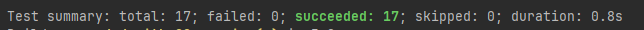

# Capítulo VI: Product Verification & Validation

## 6.1. Testing Suites & Validation
    
En esta sección se definiran las estrategias, herramientas y niveles de prueba que garantizarán la calidad, estabilidad y correcto funcionamiento del sistema tanto a nivel interno (backend) como en su interacción con las interfaces de usuario.

### 6.1.1. Core Entities Unit Tests

Las pruebas unitarias del núcleo del sistema se centran en validar la lógica de negocio contenida en las entidades de dominio (Aggregates) y sus respectivos comandos. El objetivo es asegurar que las reglas de negocio críticas, la autogeneración de identificadores y las asignaciones de propiedades funcionen correctamente antes de interactuar con servicios externos o bases de datos.

#### Tecnologías y Herramientas

- **xUnit**: Framework de pruebas de última generación para .NET, utilizado para la ejecución y estructuración de los casos de prueba.  
- **Fluent Assertions**: Librería utilizada para escribir aserciones de forma más legible y descriptiva.  
- **.NET 9 SDK**: Entorno de ejecución y compilación de las suites de prueba.

#### Metodología de Diseño: Patrón AAA

Todas las pruebas se han estructurado siguiendo el patrón **AAA (Arrange, Act, Assert)** para garantizar la claridad y mantenibilidad:

- **Arrange**: Se configuran los datos de entrada, como comandos y parámetros esperados.  
- **Act**: Se invoca el constructor de la entidad o el método de negocio a validar.  
- **Assert**: Se verifica que el estado resultante de la entidad coincida con las expectativas.

#### Casos de Prueba Implementados

Se han desarrollado un total de **17 pruebas unitarias** cubriendo los siguientes dominios:

| Dominio        | Entidad Validada     | Descripción de la Lógica Probada |
|---------------|---------------------|----------------------------------|
| Bills        | Bill                | Validación de autogeneración de ID con prefijo `"BG"`, parseo de fechas y mapeo de montos. |
| Households   | HouseHold           | Reglas defensivas: forzado de miembros mínimos (1) y moneda por defecto (USD) ante datos inválidos. |
| IAM          | User                | Registro de usuarios, manejo de roles (Admin, Member) y asignación de identificadores de hogar. |
| Contributions| Contribution        | Validación de estrategias de división (Even, IncomeBased) y corrección de bugs en asignación de parámetros. |
| Members      | MemberContribution  | Gestión de estados de pago (Pending) y vinculación correcta entre miembro y gasto. |
| Invitations  | Invitation          | Generación automática de tokens únicos (GUID) y establecimiento de fechas de expiración a 7 días. |
| Allocations  | IncomeAllocation    | Lógica de actualización de porcentajes y prefijos de identificación `"IA-"`. |

#### Evidencia de Ejecución

A continuación, se presenta los archivos y el resultado de la ejecución de la suite de pruebas unitarias desde la terminal del sistema:

### 6.1.2. Core Integration Tests

### 6.1.3. Core Behavior-Driven Development

### 6.1.4. Core System Tests
