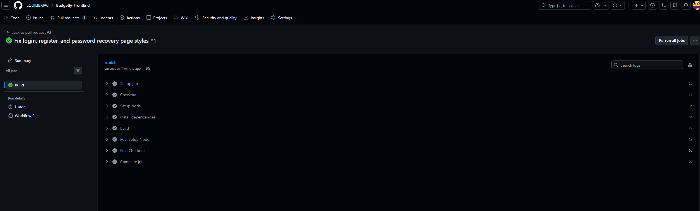
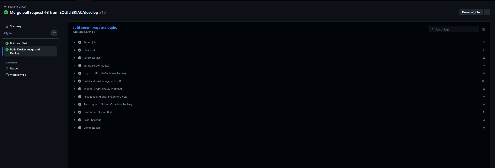
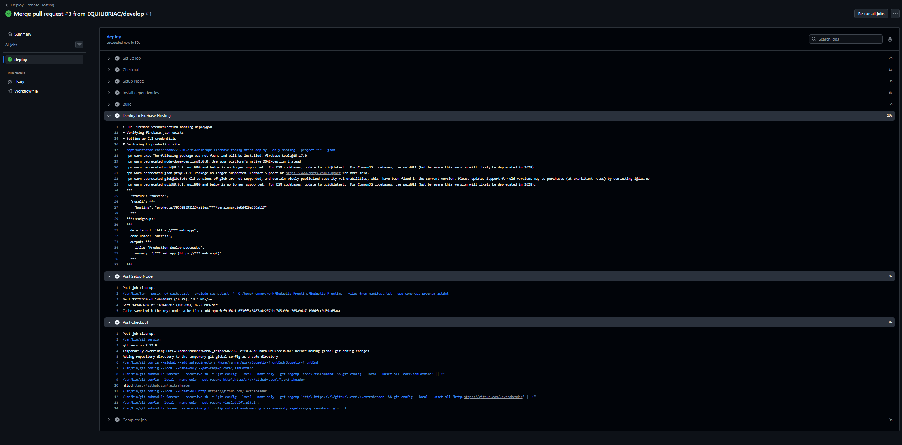
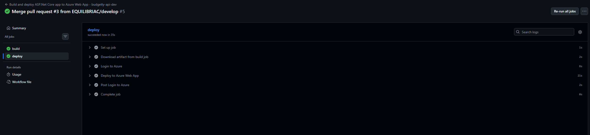

# Capítulo VII: DevOps Practices

En este capítulo se describe cómo se aplicaron prácticas de DevOps para asegurar un ciclo de desarrollo más controlado, repetible y seguro. La solución Budgetly fue organizada con un flujo de trabajo que permite validar cambios antes de su integración, empaquetar artefactos de despliegue y publicar nuevas versiones con menor intervención manual.

La estrategia implementada se apoyó principalmente en GitHub Actions, ramas `develop` y `main`, uso de secretos para credenciales y mecanismos de despliegue automáticos para el Frontend y el Back-End.

## 7.1. Continuous Integration

La Integración Continua se aplicó a los dos repositorios principales de la solución: `Budgetly-FrontEnd` y `Budgetly-BackEnd`. En ambos casos, el proceso comienza con la apertura o actualización de un Pull Request y termina con la validación automática del código mediante compilación y pruebas.

Este enfoque permitió detectar errores de integración en etapas tempranas, reducir retrabajos y asegurar que cada cambio llegue con un nivel mínimo de calidad antes de pasar a producción.

### 7.1.1. Tools and Practices

Para implementar CI se utilizaron las siguientes herramientas y prácticas:

* **GitHub Actions**: se empleó como motor de automatización para ejecutar los pipelines de validación en cada Pull Request y en los eventos de `push` a `main`.
* **GitFlow**: se mantuvo la estrategia de ramas `main`, `develop` y ramas de trabajo tipo feature para aislar cambios antes de integrarlos.
* **Branch protection**: se recomendó proteger la rama `main` para exigir checks verdes antes del merge.
* **Secrets de GitHub**: se usaron secretos para credenciales de publicación y despliegue, evitando exponer información sensible en el repositorio.

#### Frontend CI

El Frontend fue desarrollado con **Vue 3 + Vite**, por lo que la validación automática se implementó con los comandos estándar de Node.js:

* `npm ci` para instalar dependencias de forma reproducible.
* `npm run build` para generar la compilación de producción.

El workflow del Frontend se configuró para ejecutarse cuando se abre un Pull Request hacia `main`. De esta manera, cada cambio de la rama `develop` se verifica antes de promoverlo a producción.

Además, esta validación automática resulta especialmente útil en proyectos con múltiples componentes visuales, ya que permite confirmar que las vistas, estilos y módulos principales compilan correctamente antes de fusionar el código.

Se puede observar el resultado de este proceso en la siguiente evidencia del pipeline de integración continua del Frontend:

	

#### Back-End CI

El Back-End fue desarrollado con **.NET 9**, por lo que el pipeline de CI ejecuta las siguientes etapas:

* `dotnet restore Backend.sln` para restaurar dependencias.
* `dotnet build Backend.sln --configuration Release --no-restore` para compilar la solución.
* `dotnet test Backend.sln --no-build --verbosity normal` para ejecutar pruebas de la solución.
* `dotnet publish com.split.backend/com.split.backend.csproj -c Release -o publish` para generar el artefacto de despliegue.

Además de la compilación, se generó un artefacto intermedio para su uso posterior en los flujos de despliegue.

Con ello se garantizó que la solución del servidor mantuviera coherencia entre dependencias, compilación y empaquetado, evitando publicar versiones incompletas o con errores de integración.

La evidencia de este flujo para el Back-End se muestra a continuación:

	

### 7.1.2. Build & Test Suite Pipeline Components

Los componentes principales del pipeline de CI fueron los siguientes:

* **Checkout**: descarga del código fuente del repositorio.
* **Setup runtime**: instalación del entorno requerido, como Node.js para el Frontend o .NET 9 para el Back-End.
* **Restore/Install**: restauración de dependencias según el stack tecnológico.
* **Build**: compilación de la solución o del proyecto frontend.
* **Test**: validación automática del comportamiento esperado.
* **Artifact generation**: publicación de la salida compilada para su posterior uso en despliegue.

En el caso del Back-End, se incorporó la creación de una imagen Docker para empaquetar la aplicación y facilitar su publicación en el registry de contenedores.

En conjunto, estas etapas forman una cadena de validación que ayuda a confirmar que el código puede ser construido y preparado correctamente en un entorno automatizado, lo que incrementa la confiabilidad del proceso.

## 7.2. Continuous Delivery

La Entrega Continua se definió como el paso siguiente a la validación de CI. Cuando los cambios pasan las revisiones automáticas y el Pull Request es aprobado, el merge hacia `main` dispara la preparación de los artefactos finales para su publicación en los entornos productivos.

En esta etapa se priorizó que la publicación de nuevas versiones fuera consistente y trazable. De esa forma, cada despliegue queda asociado a un commit específico y puede auditarse con facilidad en caso de incidencias.

### 7.2.1. Tools and Practices

Las herramientas utilizadas para esta etapa fueron:

* **GitHub Actions** para orquestar el flujo de entrega.
* **Firebase Hosting** para el despliegue del Frontend estático.
* **GHCR (GitHub Container Registry)** para publicar la imagen Docker del Back-End.
* **Azure Web App** para hospedar el servicio ASP.NET Core del Back-End.
* **Secrets de repositorio** para almacenar credenciales de despliegue como `FIREBASE_SERVICE_ACCOUNT`, `FIREBASE_PROJECT_ID`, `GHCR_PAT` y los secretos de Azure.

En esta etapa, el despliegue no depende de acciones manuales sobre los archivos fuente, sino de eventos de integración en la rama principal.

#### Entrega del Frontend

El Frontend se publica automáticamente en **Firebase Hosting**. El workflow se dispara cuando se realiza `push` sobre `main` y realiza la compilación de producción antes de enviar los archivos estáticos al hosting.

Este mecanismo fue útil para asegurar una publicación rápida del sitio web, manteniendo la misma versión que fue validada previamente en CI.

La publicación exitosa en Firebase Hosting se evidencia en la siguiente captura:

	

#### Entrega del Back-End

El Back-End se empaqueta en una imagen Docker y se publica en **GitHub Container Registry**. Este paso permite disponer de una imagen versionada del servicio y, posteriormente, desplegarla al entorno de Azure Web App.

La publicación de la imagen en un registry centralizado facilita el control de versiones, la reutilización en distintos entornos y la recuperación del estado exacto de una entrega anterior.

La evidencia del despliegue y publicación del Back-End se muestra en la siguiente captura:

	

### 7.2.2. Stages Deployment Pipeline Components

Los componentes de la etapa de entrega se estructuraron de la siguiente forma:

* **Build artifact**: compilación del código fuente y generación del paquete de salida.
* **Containerization**: creación de la imagen Docker para el Back-End.
* **Registry publication**: publicación de la imagen en GHCR.
* **Web hosting deployment**: publicación del Frontend en Firebase Hosting.
* **Application deployment**: despliegue del Back-End en Azure Web App.

En la práctica, el Frontend y el Back-End comparten la misma lógica de promoción: primero se valida en CI sobre `develop` o en Pull Requests, y luego se publica desde `main`.

Gracias a esta secuencia, el equipo pudo mantener un flujo estable entre desarrollo, validación y entrega sin introducir pasos manuales innecesarios.

## 7.3. Continuous Deployment

El Despliegue Continuo se implementó como la automatización completa del paso final hacia producción. Una vez que el código llega a `main`, los pipelines publican automáticamente las nuevas versiones en los entornos configurados.

Este patrón reduce tiempos de publicación y permite que las mejoras aprobadas estén disponibles con mayor rapidez para el usuario final.

### 7.3.1. Tools and Practices

Las prácticas aplicadas para el despliegue continuo fueron:

* **Despliegue automático por rama principal**: el merge hacia `main` inicia la publicación.
* **Separación de responsabilidades**: un workflow valida y otro publica o despliega.
* **Uso de secretos**: se evitó colocar credenciales dentro del código fuente.
* **Versionado por commit**: las imágenes Docker se etiquetan con el hash del commit, lo que facilita identificar exactamente qué versión fue desplegada.

* **Observabilidad básica del flujo**: el historial de ejecuciones en GitHub Actions permite revisar qué etapa falló, cuánto demoró y qué artefacto fue generado.

#### Frontend en producción

El Frontend se despliega en Firebase Hosting con los secretos de servicio configurados en GitHub. El pipeline publica una versión estática consistente y permite validar rápidamente el sitio web final.

Esto asegura que los cambios visuales y funcionales del Frontend puedan publicarse con un proceso uniforme, minimizando diferencias entre el entorno local y el entorno de producción.

#### Back-End en producción

El Back-End se despliega en Azure Web App. Adicionalmente, se publica la imagen Docker en GHCR para conservar una referencia inmutable del estado de la aplicación en producción.

De esta manera, el servicio queda disponible en un entorno administrado por la nube, con una imagen de contenedor que puede reutilizarse o reemplazarse de forma controlada.

### 7.3.2. Production Deployment Pipeline Components

Los componentes finales del pipeline productivo son:

* **Trigger**: `push` a `main` o ejecución manual cuando se requiera.
* **Compile and package**: generación del artefacto de producción.
* **Publish to registry**: publicación de la imagen en GHCR.
* **Deploy to hosting**: publicación del Frontend en Firebase Hosting.
* **Deploy to cloud app service**: despliegue del Back-End en Azure Web App.

Como resultado, la solución Budgetly quedó integrada con una estrategia de CI/CD que cubre validación, empaquetado y despliegue de ambos lados del sistema.

Esta arquitectura de automatización mejora la calidad de entrega, simplifica el mantenimiento y fortalece la trazabilidad del proceso de desarrollo.

